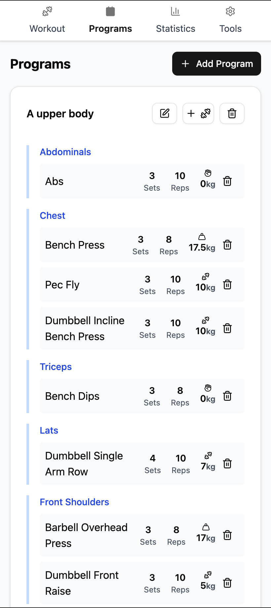
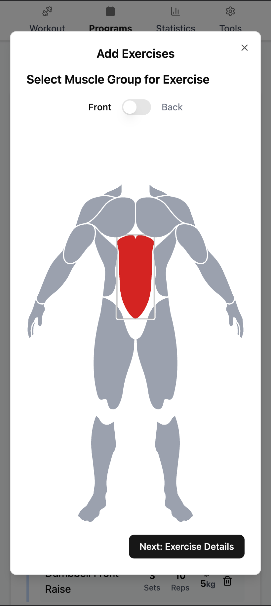
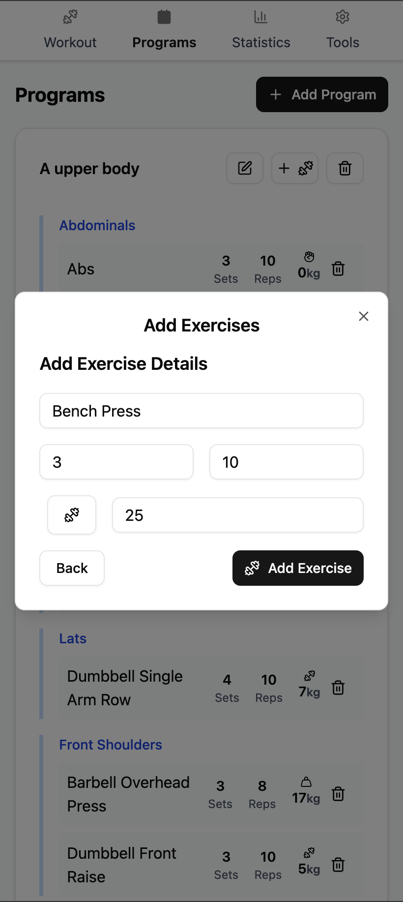
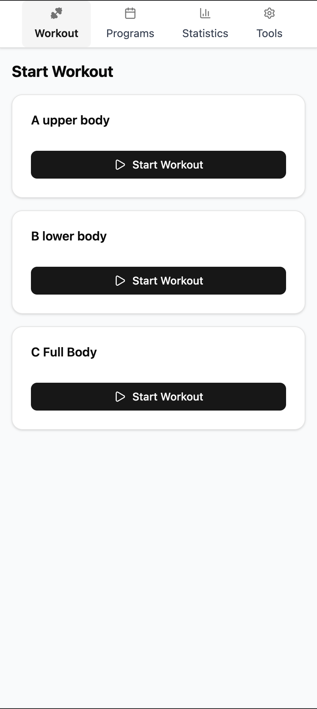
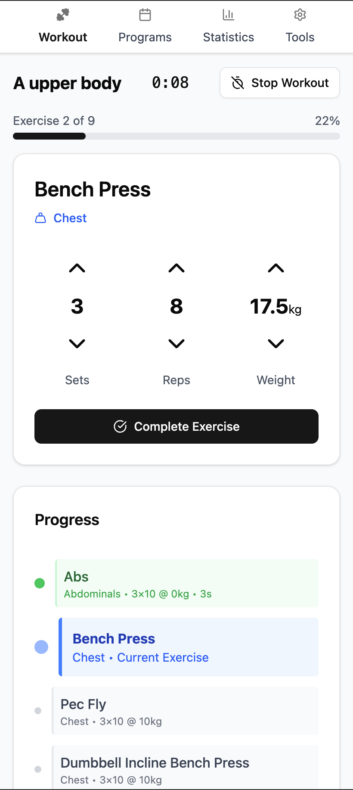
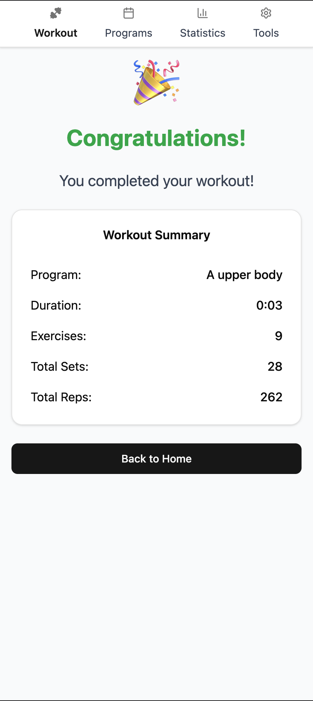
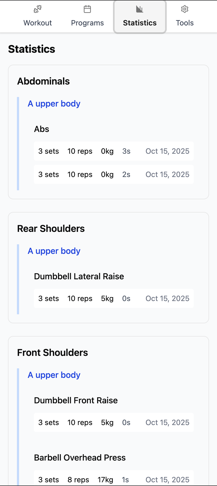

# Gym Workout Tracker

A lightweight web application for tracking gym workouts, managing exercise programs, and monitoring fitness progress.









## Features

- 📋 **Program Management**: Create and organize workout programs with exercises
- 🏋️ **Exercise Tracking**: Track sets, reps, weight, and workout duration
- 📊 **Progress Statistics**: View workout history and performance analytics
- 🎯 **Muscle Group Targeting**: Visual muscle anatomy selection for exercises
- ⚖️ **Weight Type Support**: Different weight measurement types (bodyweight, per-side, total, single)
- 📱 **Responsive Design**: Works on desktop and mobile devices
- 🎉 **Workout Completion**: Celebration screen with workout summary

## Tech Stack

- **Frontend**: React, TypeScript, Tailwind CSS, shadcn/ui
- **Backend**: Bun runtime with TypeScript
- **Database**: SQLite with Prisma ORM
- **Build**: Vite for fast development and production builds

## Quick Start

### Development

```bash
# Install dependencies
bun install

# Set up database
cp .env.example .env
bun run prisma:generate
bun run prisma:migrate:dev

# Start development server
bun dev
```

Visit `http://localhost:3000` to access the application.

### Production

```bash
# Build for production
bun run build

# Start production server
bun start
```

## Docker Deployment

### Using Docker Compose (Recommended)

Create a `docker-compose.yml` file:

```yaml
services:
  gym:
    image: ghcr.io/deanshub/gym:main
    ports:
      - "3000:3000"
    volumes:
      - /media/external/library/gym:/database
    environment:
      - DATABASE_URL=file:/database/app.db
    restart: unless-stopped
```

Run with Docker Compose:

```bash
# Build and start
docker-compose up -d

# View logs
docker-compose logs -f

# Stop
docker-compose down
```

### Using Docker directly

```bash
# Build image
docker build -t gym-tracker .

# Run container
docker run -d \
  --name gym-tracker \
  -p 3000:3000 \
  -v /media/external/library/gym:/database
```

## Database Migrations

The application automatically runs database migrations on startup in Docker. For manual migration management:

```bash
# Create new migration
bun run prisma:migrate:dev --name migration_name

# Deploy migrations (production)
bun run prisma:migrate:deploy

# Reset database (development only)
bun run prisma:migrate:reset
```

## Available Scripts

- `bun dev` - Start development server
- `bun build` - Build for production
- `bun start` - Start production server
- `bun test` - Run tests
- `bun run lint` - Run linter
- `bun run ci` - Run full CI pipeline (lint, typecheck, test, build)

## Project Structure

```
src/
├── components/          # React components
│   ├── ui/             # Reusable UI components (shadcn/ui)
│   ├── ActiveWorkoutPage.tsx
│   ├── ProgramsPage.tsx
│   └── StatisticsPage.tsx
├── api/                # Backend API routes
├── lib/                # Utility functions
├── types.ts            # TypeScript type definitions
└── index.tsx           # Application entry point

prisma/
├── schema.prisma       # Database schema
└── migrations/         # Database migrations
```

## Contributing

1. Fork the repository
2. Create a feature branch: `git checkout -b feature-name`
3. Make your changes and run tests: `bun run ci`
4. Commit your changes: `git commit -m 'Add feature'`
5. Push to the branch: `git push origin feature-name`
6. Submit a pull request

## License

This project is licensed under the MIT License.
